# BatteryAging — 锂离子电池老化半经验模型的自动识别（MATLAB 复现）

本项目参考 Paul Gasper 等人发表于 *Journal of The Electrochemical Society* 的两篇论文，用 **MATLAB** 复现了一套**数据驱动、自动识别**的电池容量衰减半经验建模流程，并分别应用于：

- **日历老化（calendar aging）** —— 对应 [Paul Gasper et al 2021, *J. Electrochem. Soc.* **168** 020502](https://iopscience.iop.org/article/10.1149/1945-7111/abdde1)
- **循环老化（cycling aging）** —— 对应 [Paul Gasper et al 2022, *J. Electrochem. Soc.* **169** 080518](https://iopscience.iop.org/article/10.1149/1945-7111/ac86a8)

> ⚠️ 仅复现了论文的部分内容（baseline 模型复现 + 自动识别流程），未覆盖原文全部实验与讨论。

---

## ✨ 这套方法在做什么

传统半经验老化模型（如 Schimpe 2018、Naumann 2020）的**子模型结构是人为写死的**——比如人为指定「阿伦尼乌斯项 × Tafel 项」来表达退化率与温度、电位的关系。本项目的核心价值在于：**把子模型结构本身交给算法去发现**，流程如下：

1. **双层优化（bi-level optimization）**
   - **全局参数 α**（所有电池共享，如时间幂指数 α₂、截距 α₀）
   - **局部参数 β**（每只电池一个退化率 β₁）
   - 先对每只电池单独拟合得到各自的 β₁，剥离出与工况无关的「内在退化率」。

2. **符号回归自动识别子模型（Lasso / SISSO）**
   - 以每只电池的 β₁ 为标签，以工况变量（温度 T、SOC、负极平衡电位 U_a、倍率 C_rate、放电深度 DOD）为输入；
   - 构造海量候选描述符（线性库 / 乘积库：含 1/T、exp(·)、多项式、各变量乘积组合等）；
   - 用 **Lasso（L1 正则）** 或 **SISSO** 做稀疏筛选，**自动选出最优、最简洁、物理可解释的子模型表达式**，把 β₁ 写成工况变量的函数。

3. **重新组装全局模型 + 交叉验证 + 自举重采样（Bootstrap）**
   - 用留一法交叉验证（Leave-One-Out CV）评估泛化误差；
   - 用 1000 次 Bootstrap 给出参数分布与 5%–95% 置信区间；
   - 最后在**验证集**和**外推工况**（日历老化外推 20 年、循环老化外推 12000 圈）上检验模型。

得到的模型既保留了半经验模型的物理可解释性，又摆脱了对「人为指定子模型」的依赖。

---

## 📁 项目结构

```
BatteryAging/
├── calendar_aging/                     # 日历老化（Gasper 2021）
│   ├── identify_Schimpe_Models.m       # 主程序入口
│   ├── data_Schimpe_2018.mat           # 原始日历老化数据（Schimpe 2018）
│   ├── Functions/                      # 优化、符号回归、绘图等子函数
│   └── Output_results/                 # 结果图与 fitted_models.mat
│
├── cycling_aging/                      # 循环老化（Gasper 2022）
│   ├── identify_cycle_Models.m         # 主程序入口
│   ├── Naumann.mat                     # 循环老化数据（由 load_data.m 生成）
│   ├── LFP_data/                       # 原始 .mat / .xlsx 数据 + load_data.m
│   ├── Functions/                      # 子函数（含 SissoRegressor.m）
│   └── outputs/                        # 结果图
│
└── README.md
```

### 两个子项目的对应关系

| 维度 | `calendar_aging` | `cycling_aging` |
|------|------------------|-----------------|
| 参考论文 | Gasper 2021, JES **168** 020502 | Gasper 2022, JES **169** 080518 |
| 原始数据来源 | Schimpe et al. 2018 | Naumann et al. 2020, JPS **451** 227666 |
| 时间变量 `t` | 天数（days） | 等效满充放电次数 EFCs |
| 工况变量 | 温度 T、SOC、负极平衡电位 U_a | 温度 T、SOC、U_a、倍率 C_avg、放电深度 DOD |
| baseline 模型 | Schimpe t^0.5（Arrhenius–Tafel） | Naumann (C_rate, DOD)·EFC^0.5 |
| 子模型识别算法 | Lasso | **SISSO**（可切换 Lasso） |

---

## 🔧 环境与依赖

- **MATLAB**（建议 R2020a 及以上）
- **Statistics and Machine Learning Toolbox** —— 提供 `nlinfit`、`lasso`、`cvpartition`、`prctile` 等
- **cycling_aging 额外依赖：**
  - **`slanCM`** —— 第三方绘图配色工具箱（[slandarer/slanColor](https://github.com/slandarer/slanColor)），用于循环老化结果图的配色。安装方法二选一：

    ```bash
    # 方式一：git clone（推荐）
    cd cycling_aging
    git clone https://github.com/slandarer/slanColor.git slanCM
    ```

    或手动下载仓库 ZIP，解压后将文件夹**重命名为 `slanCM`** 放到 `cycling_aging/` 下——主程序通过 `addpath('slanCM')` 加载，**文件夹名必须为 `slanCM`**，否则会报路径错误。该依赖已写入 `.gitignore`，不会随仓库上传，需各自下载。

  - **SISSO** —— 通过 `Functions/SissoRegressor.m` 调用，子模型识别默认走 SISSO 分支。如需改用 Lasso，把 `identify_cycle_Models.m` 中的 `select_alg = 'SISSO'` 改为 `'Lasso'` 即可。

---

## 🚀 快速开始

```matlab
% 1. 日历老化
cd calendar_aging
identify_Schimpe_Models        % 运行主程序，结果写入 Output_results/

% 2. 循环老化（首次需先生成 Naumann.mat）
cd cycling_aging/LFP_data
load_data                      % 从原始 .mat 提取，生成上一级目录的 Naumann.mat
cd ..
identify_cycle_Models          % 运行主程序，结果写入 outputs/
```

> 主程序运行耗时主要来自 Bootstrap 重采样（1000 次）与 SISSO 搜索，整体约数分钟。

---

## 📊 日历老化结果（`calendar_aging/Output_results`）

流程依次完成：复现 Schimpe 2018 baseline → 重新优化 t^0.5 模型 → 自动识别**幂律模型** `q = α₀ − β₁(T,SOC,U_a)·t^α₂` → 自动识别 **S 型模型** → 三者对比。

三种模型定义：

```
t^0.5  :  q_dis = 1 − β₁(T, U_a) · t^0.5
幂律    :  q_dis = α₀ − β₁(T, SOC, U_a) · t^α₂
S 型    :  q_dis = α₀ − 2·β₁ · (0.5 − 1/(1+exp((α₂·t)^β₃)))
```

**① 训练集三模型对比**（`Train_data1.png`）

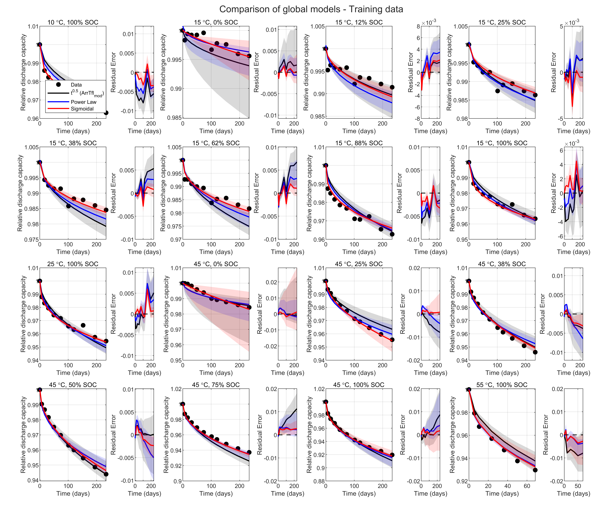

**② 验证集三模型对比**（`Valid_data1.png`）

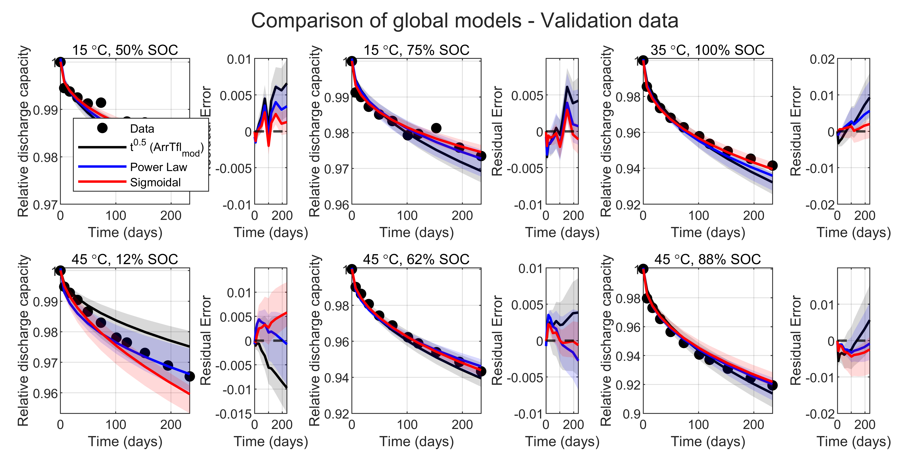

**③ 训练误差指标对比** —— MSE 与交叉验证 MSE（`MSE.png`）

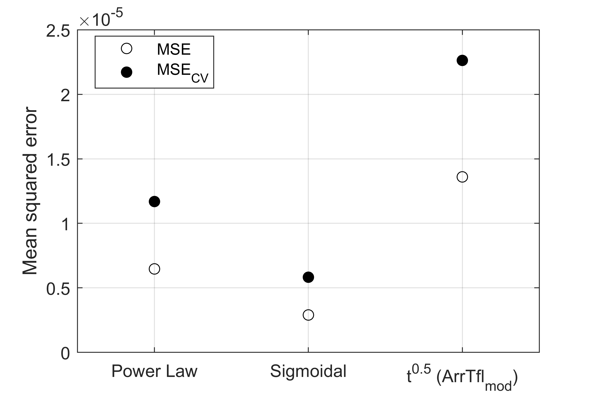

---

## 📊 循环老化结果（`cycling_aging/outputs`）

流程依次完成：绘制原始数据 → 复现 Naumann 2020 baseline → 重新优化 EFC^0.5 模型 → 用 **SISSO 符号回归**自动识别幂律模型 `q = α₀ − β₁(C_avg, DOD)·EFC^α₂`。以下图片**按主程序执行顺序**展示：

**① 原始循环老化数据总览**（`raw_plot.png`）

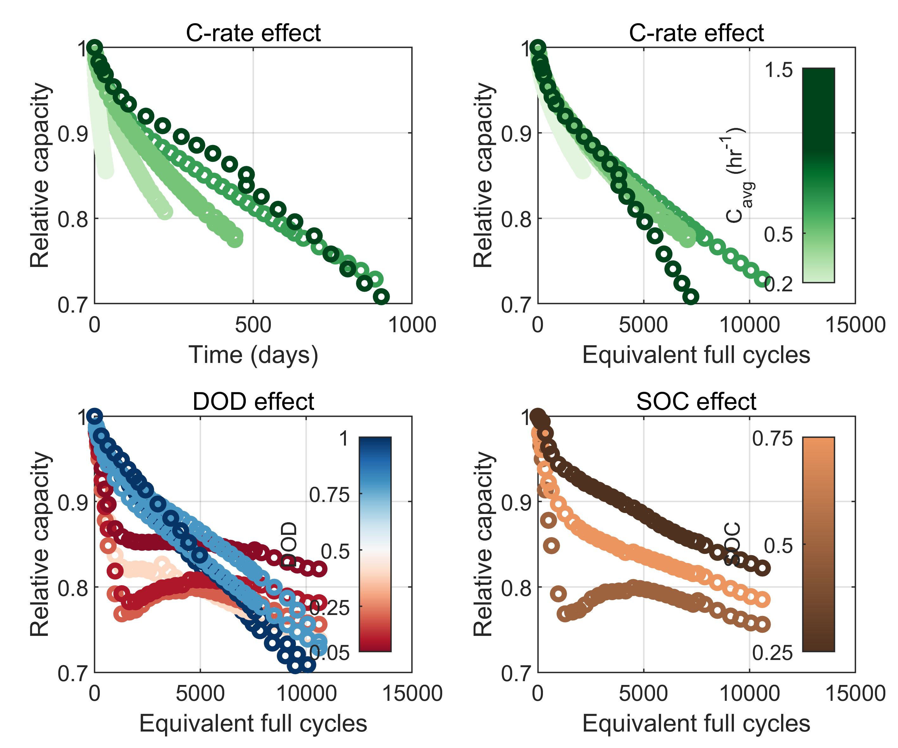

**② 复现 Naumann 2020 baseline（全部数据）** —— `q = 1 − k(C_rate, DOD)·EFC^0.5`（`Naumann_model.png`）

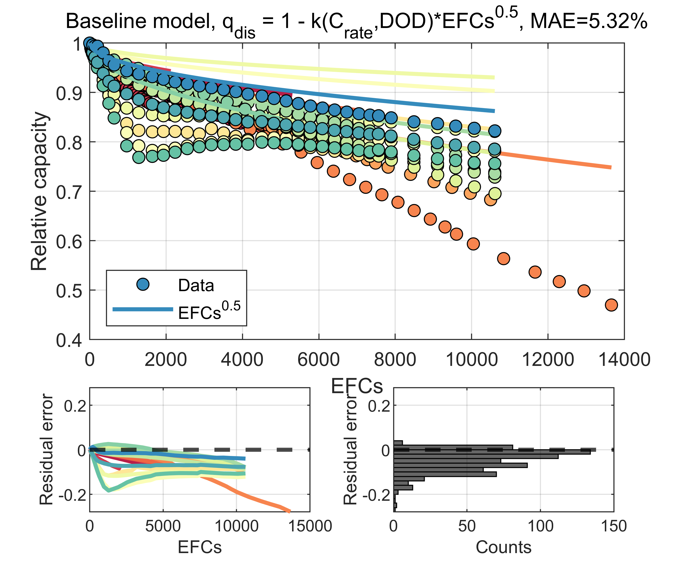

**③ Naumann baseline 仅在 DOD 扫描组上的表现**（`Naumann_model_DOD.png`）

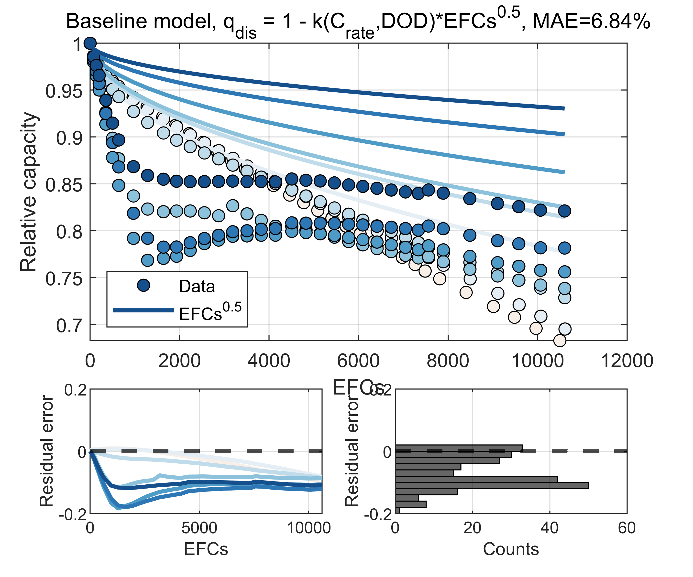

**④ t^0.5 局部拟合** —— 为每只电池拟合各自的退化率 β₁（`sqrt_local_train.png`）

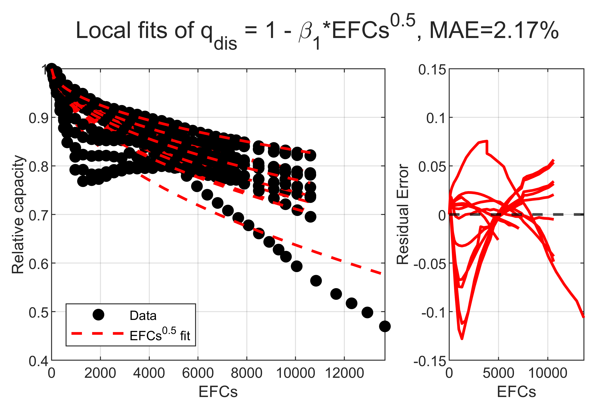

**⑤ t^0.5 全局模型 · 训练集**（`sqrt_ArrTflmod_train.png`）

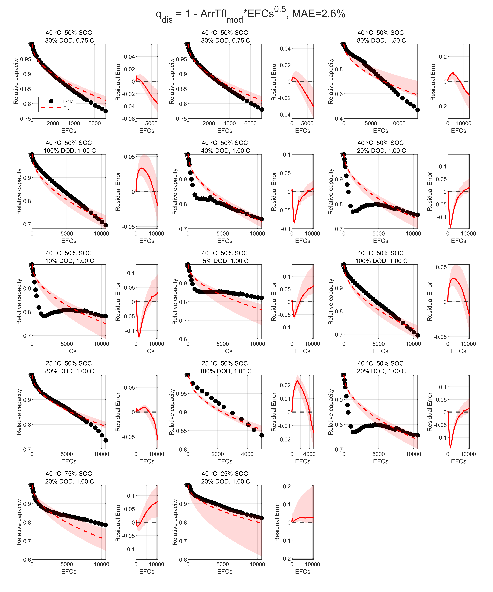

**⑥ t^0.5 全局模型 · 验证集**（`sqrt_ArrTflmod_validation.png`）

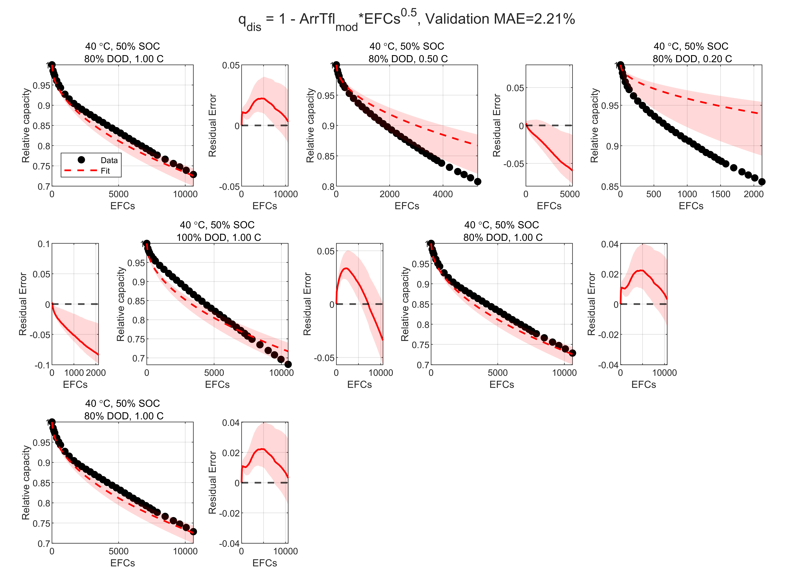

**⑦ t^0.5 全局模型 · 12000 圈外推模拟**（`sqrt_ArrTflmod_sim.png`）

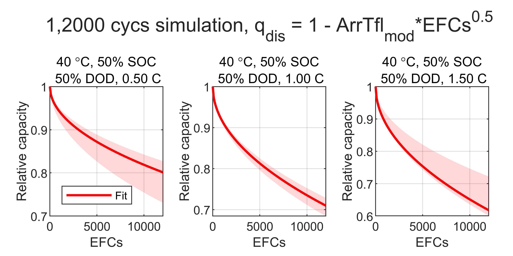

**⑧ 简化模型 vs Naumann baseline 对比**（`sqrt_ArrTflmod_train vs Naumann.png`）


**⑨ SISSO 符号回归幂律模型 · 训练集**（`siMult_train.png`）

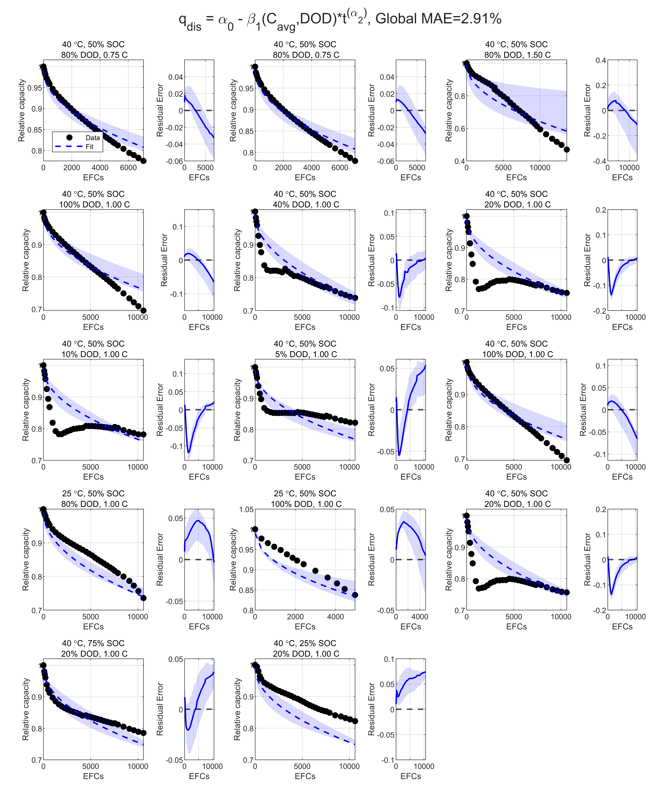

**⑩ SISSO 符号回归幂律模型 · 验证集**（`siMult_validation.png`）

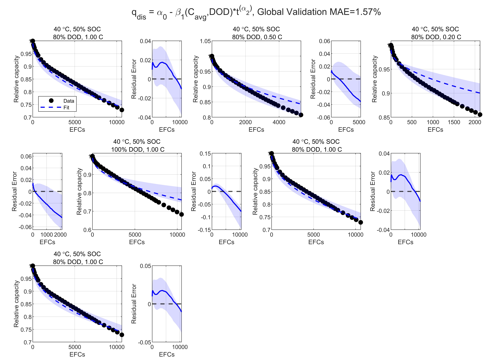

**⑪ SISSO 符号回归幂律模型 · 12000 圈外推模拟**（`siMult_sim.png`）

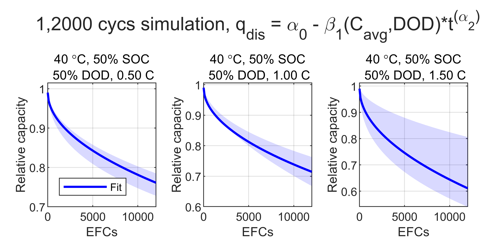

---

## 📝 致谢与引用

本项目的建模方法学与数据组织方式源自：

- Paul Gasper, ... , 2021, *Journal of The Electrochemical Society* **168**, 020502.
- Paul Gasper, ... , 2022, *Journal of The Electrochemical Society* **169**, 080518.

日历老化原始数据来自 Schimpe et al. (2018)；循环老化原始数据来自 Naumann et al. (2020), *J. Power Sources* **451**, 227666。负极平衡电位 U_a 的参数化依据 Safari & Delacourt (2011)。

循环老化用到的第三方工具：绘图配色 [`slanCM`](https://github.com/slandarer/slanColor)。

---

## 📄 License

本项目代码采用 [MIT License](LICENSE) 开源，可自由使用、修改与分发。

需特别注意：本项目**复现并使用了他人发表的实验数据与模型方法**（Schimpe 2018、Naumann 2020、Gasper 2021/2022 等），这些原始数据与论文内容的版权归原作者所有。MIT 许可仅覆盖本项目作者自行编写的代码，不延伸至上述第三方数据与文献。
